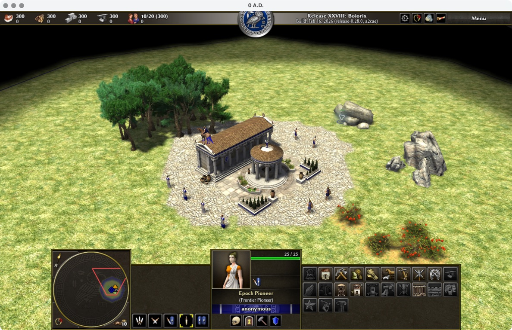

<!-- Purpose: Actual M1 acceptance evidence and outstanding checks; Created: 2026-09-07. -->
# M1 驗收紀錄

日期：2026-09-06～2026-09-07。結論：**DONE（M1 範圍）；基線、Mod 載入、畫面、Pioneer 選取／移動與正常退出均已驗收。**

## 環境與版本

- macOS 26.6.2（25G83）、Apple M4、16 GB RAM，arm64。
- 官方 0 A.D. 0.28.0 macOS ARM64；DMG SHA-256 與[官方校驗檔](https://releases.wildfiregames.com/0ad-0.28.0-macos-aarch64.dmg.sha256sum)一致：`8c53566123fed9a79766c364e543d6e9dc7c84f642c78d2bb5892eeea9c4c052`。
- Bundle 與 public/mod.json 都為 0.28.0；自訂 Mod 0.1.0，沒有引擎程式修改。
- 測試方法見 [baseline](../baseline.md)，工具見 [smoke-macos.py](../../../tools/epoch-rts/smoke-macos.py)。

## 已執行結果

| 檢查 | 結果 | 證據及限制 |
| --- | --- | --- |
| 下載完整性與安裝 | PASS | SHA-256 一致；磁碟映像 CRC 驗證通過；app 複製到本地測試目錄 |
| 官方 runtime 啟動 | PASS | 遊戲程序啟動並完成顯示裝置初始化，設定 1280×800；實際場景截圖如下 |
| Mod 相依與載入 | PASS（非視覺） | 引擎載入 public 0.28.0 與 epoch_rts 0.1.0，實際生成 Frontier 地圖並模擬 |
| seed 42 | PASS（非視覺） | [原始結果 JSON](m1-seed-42.json)：至少 100 回合後主動停止，無記錄錯誤／警告 |
| seed 7 | PASS（非視覺） | [原始結果 JSON](m1-seed-7.json)：同上 |
| 語法 | PASS | JSON／XML 可解析、JavaScript 以 ES module 語法檢查、啟動腳本通過 bash 語法檢查 |
| 畫面、模型與自訂名稱 | PASS | 實際顯示地形、市中心、資源與工人；選取面板顯示 Epoch Pioneer／Frontier Pioneer。見下方截圖 |
| 選取與移動 | PASS | 滑鼠選取 entity 244，右鍵命令移動；觀察到步行及抵達指定空地，前後截圖已保存 |
| 正常退出與日誌 | PASS | 以遊戲視窗的 Command-Q 退出，程序 exit 0；778 messages、0 errors、0 warnings |

測試的 `exit_code: -15` 是測試在回合門檻後主動以 SIGTERM 結束自己啟動的程序，不是正常退出證據；正常退出已另由本次視覺測試確認。兩個 seed 只證明這兩組地圖設定的生成／模擬，不是全部隨機地圖、採集／建造流程、存檔、AI、多人或效能驗收。

地圖 marker `pioneers=2` 是生成器成功放置兩個自訂模板引用後產生的訊息；配合實際引擎模擬與無錯誤日誌，作載入驗證。它本身不能證明模型外觀、可選取性或移動表現；這些項目由下列獨立畫面操作驗收確認。

## 已修正的相容性問題

1. R28 的 `playerPlacementCircle` 回傳物件，已改用具名欄位。
2. 舊 `isNomad()` 呼叫改為讀取 map settings。
3. R28 使用 `export function* generateMap(mapSettings)`；初版沿用舊入口導致載入未完成，非視覺路徑出現 `fmt::v7::format_error`。先用官方地圖確認引擎可運行，再修正入口並重新通過自訂地圖測試。

另曾試用 RL interface，但這個發行包的該啟動嘗試直接退出且沒有建立可用服務，未將它列為交付或驗證依據。最終測試使用實際可運行的 `-autostart-nonvisual`，不依賴額外服務。

## 2026-09-07 畫面與操作驗收

使用者完成 Computer Use 權限後，實際以 `launch-macos.sh` 啟動同一份已提交的 Mod（程式 commit `4bd8e2ceb7031cc4c8260280fde969620b745d6d`），未修改遊戲程式。

1. Frontier 01 進入可操作場景，抽查草地、市中心、樹木、礦石、莓果與工人，未見缺失貼圖或明顯模型異常。
2. 點選市中心右上方的自訂工人；選取面板顯示 **Epoch Pioneer (Frontier Pioneer)**、玩家色及 25/25 生命值。
3. 右鍵指定右側空地，觀察到工人步行並抵達；同一單位保持選取，名稱與生命值顯示正常。
4. Replay 記錄 entity `244` 的 `walk` 命令，目標 `x=642.1102294921875, z=364.1474914550781`；本次共 338 個 replay turns。這只是單機操作紀錄，不是 replay 重播或多人同步驗收。
5. Command-Q 正常退出；程序 exit 0，日誌於 2026-09-07 09:06:45（Asia/Taipei）記錄 778 messages、0 errors、0 warnings。

[機器可讀摘要](m1-visual.json)。既有非視覺測試 JSON 中 `visual_verified: false` 保持不變，避免把不同測試的證據混在一起。

### 選取自訂工人

### 移動後抵達右側空地

截圖中的暫用美術由 Wildfire Games 提供，依 [CC BY-SA 3.0](https://creativecommons.org/licenses/by-sa/3.0/)；來源 [Wildfire Games](https://www.wildfiregames.com/)，詳見 [資產登錄](../assets.md)。本階段未驗收 tooltip 的所有顯示狀態、正式美術、兩時代、AI、存讀檔或多人。

完整引擎日誌可能包含本機路徑及設定，僅保留本機；repo 中只提交去除私人資料的結果。此文件不附使用者提供的 macOS 權限畫面。
